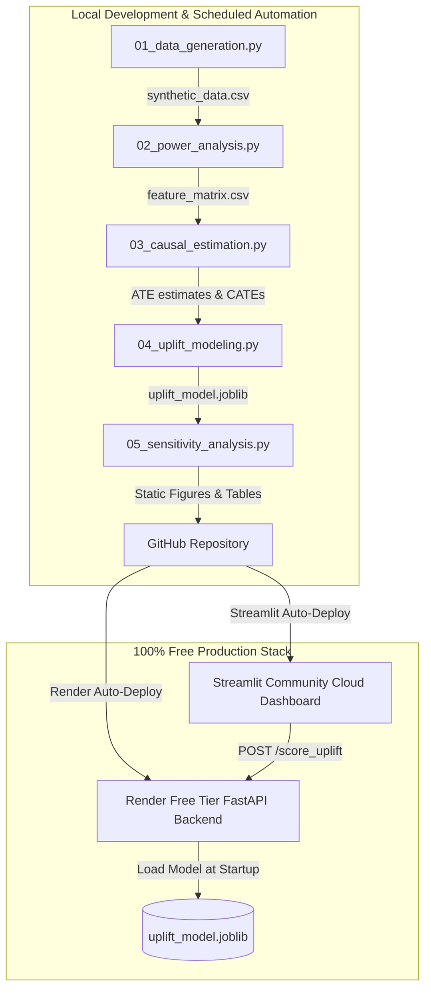

# 🔬 Causal Inference & Uplift Modeling Platform

[](https://your-portfolio-uplift-app.streamlit.app)
[](https://uplift-modeling-api.onrender.com/health)

A complete end-to-end system demonstrating **real causal reasoning** for
marketing/pricing decisions. This project proves why correlation-based targeting
fails and how to fix it using proper causal methods.

---

## 📋 Table of Contents

1. [Quick Start](#-quick-start)
2. [The Problem](#-the-problem-why-correlation--causation)
3. [Architecture](#-architecture)
4. [Pipeline Modules](#-pipeline-modules)
5. [Key Assumptions & Where They Break](#-key-assumptions--where-they-break)
6. [Why Correlation-Based Targeting Fails](#-why-correlation-based-targeting-fails)
7. [How to Fix It: Causal Methods](#-how-to-fix-it-causal-methods)
8. [Dependencies](#-dependencies)

---

## 🚀 Quick Start

```bash
# 1. Install dependencies
pip install -r requirements.txt

# 2. Run the full pipeline
python 01_data_generation.py      # Generate synthetic data with confounders
python 02_power_analysis.py       # Power analysis & sample size
python 03_causal_estimation.py    # PSM, IPW, Causal Forest estimation
python 04_uplift_modeling.py      # Meta-learners, segmentation, ROI
python 05_sensitivity_analysis.py # Placebo tests, Rosenbaum bounds

# 3. Launch the interactive dashboard
streamlit run streamlit_app.py
```

All outputs (figures, tables, data) are saved to the `outputs/` directory.

---

## 🎯 The Problem: Why Correlation ≠ Causation

### Scenario

An e-commerce company runs a promotional campaign (discount emails) targeted at
a subset of users. The marketing team wants to know: **"Did the campaign work?"**

### The Trap

The marketing team selected recipients based on customer value — **frequent,
high-spending, recently active customers were more likely to receive the email.**
This seems sensible but creates a fatal analytical problem:

```
                    ┌─────────────┐
                    │  Customer   │
                    │   Value     │
                    │ (Confounder)│
                    └──────┬──────┘
                           │
              ┌────────────┼────────────┐
              ▼                         ▼
      ┌───────────────┐        ┌───────────────┐
      │   Treatment   │        │   Purchase    │
      │  (Discount)   │───?───▶│   Amount      │
      └───────────────┘        └───────────────┘
```

**Customer value** affects BOTH who gets treated AND who buys more. A naïve
comparison (`mean(treated) - mean(control)`) picks up this confounding, making
the campaign look 2× more effective than it really is.

### The Numbers

| Estimate | Value | Status |
|---|---|---|
| Naïve (correlation-based) | ~₹261 | ❌ **WRONG** — includes confounding bias |
| True causal effect | ~₹168 | ✅ What we need to recover |
| Bias | ~₹93 | 🚨 +55% overestimate |

---

## 🏗️ Architecture



```
causal-inference-platform/
├── config.py                    # Central hyperparameters & constants
├── 01_data_generation.py        # Synthetic DGP with confounders
├── 02_power_analysis.py         # Power analysis & sample size
├── 03_causal_estimation.py      # PSM, IPW, Causal Forest + naïve
├── 04_uplift_modeling.py        # Meta-learners, segmentation, ROI
├── 05_sensitivity_analysis.py   # Placebo, Rosenbaum bounds, balance
├── streamlit_app.py             # Streamlit Cloud deployment dashboard
├── decision_memo.md             # One-page stakeholder memo
├── requirements.txt             # Dashboard dependencies
├── render.yaml                  # Render Blueprint definition
├── app/
│   ├── main.py                  # FastAPI server script
│   ├── models.py                # Wrapper classes for scikit-learn meta-learners
│   └── requirements.txt         # Minimal API server requirements
└── outputs/
    ├── figures/                 # Precomputed charts & visualizations
    ├── tables/                  # CSV summary tables
    └── data/                    # Generated CSV datasets
```

---

## 📦 Pipeline Modules

### Module 1: Data Generation (`01_data_generation.py`)

Generates 20,000 synthetic e-commerce users with:
- **Features:** recency, frequency, monetary value, tenure, channel, age group
- **Confounded treatment:** High-value users are more likely to be treated
- **Heterogeneous effects:** Young, app-using, moderate-frequency users benefit most
- **Ground truth embedded:** True τ(X) is known for validation

**Treatment assignment (NOT random):**
```
logit(P(T=1)) = -1 + 0.8·log(monetary) + 0.5·frequency - 0.3·recency/100
```

**Heterogeneous treatment effect:**
```
τ(X) = 150 + 50·I(age=18-25) - 30·I(freq>8) + 20·I(channel=app)
```

### Module 2: Power Analysis (`02_power_analysis.py`)

- Minimum Detectable Effect (MDE) for our sample size
- Required sample sizes for various target MDEs
- Power curves across effect sizes and sample sizes
- Confirms N=20,000 is sufficient for detecting the true ATE

### Module 3: Causal Estimation (`03_causal_estimation.py`)

| Method | Approach | Handles Heterogeneity? |
|---|---|---|
| **Naïve** | Simple mean difference | No |
| **PSM** | Match treated to similar controls | No (single ATT) |
| **IPW** | Re-weight by inverse propensity | No (single ATE) |
| **Causal Forest** | Double-debiased ML | **Yes** (individual CATEs) |

### Module 4: Uplift Modeling (`04_uplift_modeling.py`)

- **S-Learner:** Single model, treatment as feature (simplest)
- **T-Learner:** Two models, one per group (most intuitive)
- **X-Learner:** Propensity-weighted hybrid (most robust)
- **Segmentation:** Persuadables / Sure Things / Lost Causes / Sleeping Dogs
- **ROI comparison:** Uplift-based vs. probability-based targeting

### Module 5: Sensitivity Analysis (`05_sensitivity_analysis.py`)

- **Placebo test:** Randomly reassign treatment → ATE should be ~0
- **Rosenbaum bounds:** How strong must an unmeasured confounder be to nullify results?
- **Covariate balance:** SMD and variance ratio diagnostics
- **Random common cause:** Adding noise variables shouldn't change the estimate

### Module 6: Dashboard (`06_dashboard.py`)

Interactive Streamlit app with 5 tabs for exploring all results.

---

## ⚠️ Key Assumptions & Where They Break

### 1. Unconfoundedness (No Unmeasured Confounders)

**Assumption:** `Y(0), Y(1) ⊥ T | X` — Given the observed covariates, treatment
assignment is as-if-random.

**Where it breaks:** If there's a variable we DIDN'T observe (e.g., customer
browsing behavior, intent signals, competitor pricing) that affects both who gets
treated and who buys. In our simulation, unconfoundedness holds by construction.
In real life, it's **unprovable** — we can only assess sensitivity (Rosenbaum bounds).

**Mitigation:**
- Include as many pre-treatment covariates as possible
- Use sensitivity analysis to quantify vulnerability
- Run a proper RCT when possible

### 2. SUTVA (Stable Unit Treatment Value Assumption)

**Assumption:** One user's treatment doesn't affect another user's outcome.

**Where it breaks:**
- **Social/network effects:** User shares discount code with friends
- **Market-level effects:** Large-scale discounting changes competitor behavior
- **General equilibrium:** If 50% of users get discounts, this may shift demand curves

**Mitigation:**
- Cluster-randomized experiments (randomize at group level)
- Use interference-aware causal methods
- Monitor for spillover patterns

### 3. Overlap / Positivity

**Assumption:** `0 < P(T=1|X) < 1` for all X — every user has some chance of
being in either group.

**Where it breaks:**
- If VIP customers ALWAYS get discounts: P(T=1|VIP) = 1
- If new users NEVER get discounts: P(T=1|new) = 0
- Extreme propensity scores → huge IPW weights → unstable estimates

**Mitigation:**
- Trim extreme propensity scores (we clip at 1st/99th percentile)
- Use matching with calipers to drop unmatched units
- Check propensity score overlap plots

### 4. Correct Model Specification

**Assumption:** Our propensity score model correctly captures the true treatment
selection mechanism.

**Where it breaks:**
- Non-linear interactions we didn't model
- Missing variables
- Distributional misspecification

**Mitigation:**
- Use flexible models (Random Forest, GBM) for propensity estimation
- Double ML (CausalForestDML) is more robust to misspecification
- Cross-validate propensity models

---

## 🚫 Why Correlation-Based Targeting Fails

### The Standard ML Approach (Wrong)

A typical data science team would:
1. Train a model to predict P(purchase | X)
2. Target users with the highest P(purchase)
3. Measure "success" by comparing treated vs. control outcomes

**The problem:** This targets **Sure Things** — users who would buy regardless.
You're essentially paying (via discounts) for purchases that were already going
to happen.

### Example from Our Data

| User Type | P(purchase) | τ(X) | What Happens |
|---|---|---|---|
| Loyal, frequent buyer | 0.92 | ₹120 | Buys anyway. Discount is wasted money. |
| Young, moderate buyer | 0.45 | ₹220 | **Only buys WITH discount.** This is incremental. |
| Inactive, old account | 0.08 | ₹150 | Won't buy regardless. Don't bother. |
| Price-sensitive switcher | 0.60 | -₹30 | Discount triggers hoarding → **negative** long-term effect. |

A response model ranks User 1 highest (P=0.92). An uplift model ranks User 2
highest (τ=₹220). **User 2 is the one generating actual incremental revenue.**

### The Fix: Uplift Modeling

Instead of predicting `P(Y|X)`, predict `P(Y|X,T=1) - P(Y|X,T=0)`:

- **S-Learner:** Fit one model with treatment as a feature
- **T-Learner:** Fit separate models for treated/control
- **X-Learner:** Propensity-weighted combination

Then target users ranked by **uplift score**, not **purchase probability**.

---

## 📊 Dependencies

| Package | Version | Purpose |
|---|---|---|
| numpy | ≥1.24 | Array operations |
| pandas | ≥2.0 | Data manipulation |
| scipy | ≥1.10 | Statistical tests |
| statsmodels | ≥0.14 | Power analysis |
| scikit-learn | ≥1.3 | RandomForestRegressor (Base learner for meta-learners) |
| econml | ≥0.15 | Causal Forest DML |
| causalml | ≥0.15 | Meta-learners, Qini curves |
| matplotlib | ≥3.7 | Static plots |
| seaborn | ≥0.13 | Statistical visualizations |
| plotly | ≥5.18 | Interactive plots |
| streamlit | ≥1.30 | Dashboard |

## ⚠️ Known Limitations

1. **Synthetic Data DGP Simplification:**
   While we design realistic confounding (e.g. logit selection probabilities based on historical spend, purchase frequency, and recency), the true selection mechanism is fully observable to our scripts. In a real-world setting, confounding is typically **unobserved or partially observed** (e.g., hidden intent, seasonal browsing habits, competitor campaigns), which makes conditional ignorability ($Y(0), Y(1) \perp T \mid X$) an unprovable assumption.
2. **Observational vs. Experimental Data:**
   In observational data, we must run complex causal adjustment models (PSM, IPW, Double ML) to estimate the ATE. If we had a true **Randomized Controlled Trial (RCT) / A/B Test**, selection bias would be mathematically eliminated ($P(T \mid X) = P(T)$). The naive difference in means would equal the true ATE. However, even with an RCT, **Uplift Modeling remains crucial** to predict heterogeneous treatment effects (i.e. identify *who* responds most, rather than just estimating the average response).
3. **Deliberately Batch-Scored System:**
   This architecture is fundamentally batch-oriented. Unlike fraud detection (which requires real-time sub-second velocity scoring), marketing discount allocations are executed periodically (weekly/monthly email campaigns, push blast lists). Hence, scoring runs as an offline job, the results are saved in a table, and the API backend serves predictions on pre-scored customer profiles. We do not introduce heavy streaming brokers (like Kafka/PubSub) or low-latency cache stores (Redis) as the business problem doesn't demand them.

---

## 💬 Interview Questions to Expect

### 1. Why use uplift modeling instead of standard propensity-to-respond targeting?
*   **The Problem with Propensity:** Standard response models predict $P(Y=1 \mid X)$ (the likelihood of purchase). This targets **Sure Things** (loyal customers who would buy anyway) and wastes budget. It also risks targeting **Sleeping Dogs** (customers annoyed by the contact who buy less).
*   **The Uplift Solution:** Uplift modeling predicts the treatment effect $\tau(X) = P(Y=1 \mid T=1, X) - P(Y=1 \mid T=0, X)$. It isolates **Persuadables** (those who only buy when treated), maximizing the ROI of every rupee spent.

### 2. How do you know if your causal assumptions hold?
In observational studies, we must satisfy:
*   **Conditional Ignorability:** No unmeasured confounders. We test sensitivity to violations using **Rosenbaum Bounds**. Our analysis shows that a hidden confounder would need to triple the odds of treatment ($\Gamma = 3.00$) to invalidate our ATE.
*   **Overlap/Positivity:** Every customer has a non-zero treatment probability. We verify this via mirrored propensity score histograms, confirming common support across groups.
*   **SUTVA:** One customer's treatment does not affect another's outcome. This is checked by verifying coupon codes are non-shareable and monitoring for social network spillovers.

### 3. What would you do differently with a true randomized experiment?
*   **Direct ATE Estimation:** We would bypass PSM and IPW adjustments. The simple difference in group means would serve as an unbiased estimator of ATE.
*   **Better Uplift Ground Truth:** The meta-learners (T/X-learners) would train on clean, unconfounded experimental splits, enhancing the accuracy and robustness of predicted individual-level treatment effects.

---

## 📄 License

This project is for educational and demonstration purposes.

## 🙏 Acknowledgments

- **EconML** (Microsoft Research) for Causal Forest implementation
- **CausalML** (Uber) for uplift meta-learners
- Rosenbaum (2002) *Observational Studies* for sensitivity analysis framework
- Athey & Imbens (2016) for the Causal Forest methodology
